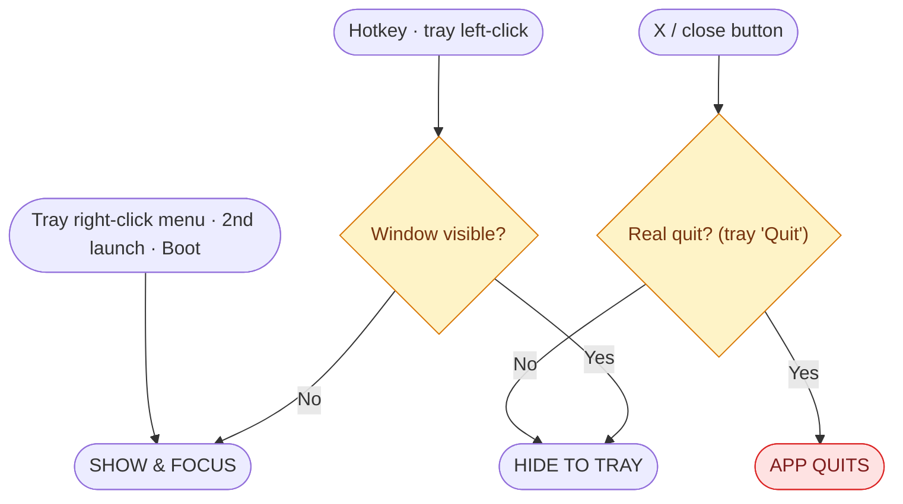

# Window state & transition reference

The single reference for how the app window shows, hides, focuses, and quits.
Everything here is drawn from `src/main/index.ts` — it describes what the code
is **intended** to do. Rows still marked _(unverified)_ have not been confirmed
against Electron docs or by repeat hands-on testing on Windows.

## States

| State | Meaning | On screen? |
| --- | --- | --- |
| **Booting** | App starting, window not shown yet (`win` created with `show: false`). | no |
| **Visible** | Window shown. May or may not have OS focus — both count as Visible. | yes |
| **Hidden (tray)** | Minimized then hidden — only the tray icon remains. | no |
| **Quit** | `isQuitting` set, app shutting down. Terminal. | — |

> Only 2 real states matter for toggling: **Visible** and **Hidden (tray)**.
> Toggle decisions are based on `isVisible()` alone, not focus — a visible
> but unfocused window (e.g. you alt-tabbed away) stays Visible until
> something explicit hides it. Nothing hides it automatically on blur.

## Flowchart

`SHOW & FOCUS` = `showAndFocusWindow()`: `show()` then `focus()`. No `restore()`
step — removed during testing; `show()` alone was enough to bring back a
minimized window on this setup (see "Not yet verified" below).

`HIDE TO TRAY` = `hideToTray()`: `minimize()` then `hide()`.

## Transition table

| From | Input / event | Action in code | To |
| --- | --- | --- | --- |
| Booting | first boot, `ready-to-show` | `showAndFocusWindow()` | Visible |
| Visible | hotkey / tray left-click | `isVisible()` true → `hideToTray()` | Hidden (tray) |
| Visible | X button | `preventDefault()` + `hideToTray()` | Hidden (tray) |
| Visible | tray right-click → "Hide" | `hideToTray()` | Hidden (tray) |
| Visible | tray "Quit" | `isQuitting = true`, `app.quit()` | Quit |
| Visible | click another app | (OS-level, no handler) | Visible (unchanged — stays Visible, just unfocused) |
| Hidden (tray) | hotkey / tray left-click | `isVisible()` false → `showAndFocusWindow()` | Visible |
| Hidden (tray) | tray right-click → "Show" / second launch | `showAndFocusWindow()` | Visible |
| Hidden (tray) | tray "Quit" | `app.quit()` | Quit |

Tray left-click and the hotkey both call the same `toggleWindowVisibility()`.
Tray right-click doesn't toggle directly — it opens a menu built fresh each
time, with the label ("Show"/"Hide") reflecting current state; clicking that
item calls the same toggle function.

## Why isFocused() isn't used

Clicking the tray icon always blurs the main window first (OS behavior) —
by the time the tray's `click` handler runs, `win.isFocused()` already reads
`false`, regardless of what the window's real state was a moment earlier.
That makes any toggle based on `isFocused()` at click-time indistinguishable
between "was focused, click should hide" and "was already hidden" — it
always resolved to show again (a visible hide→show flicker). Deciding on
`isVisible()` alone sidesteps this, since blurring alone never changes
visibility.

Trade-off: a window that's visible but unfocused (e.g. you alt-tabbed away)
will *hide* on the next toggle rather than come back to focus first. Accepted
as out of scope for now.

## Not yet verified

These are assumptions baked into the code, not confirmed facts:

- That `show()` alone (no `restore()`) reliably un-minimizes and focuses the
  window on Windows, across repeated hide/show cycles, machines, and Windows
  versions. Currently based on one round of manual testing. _(unverified)_
- That a native `minimize` cannot be canceled (handler runs after the fact),
  which is why we route it to `hide()` rather than prevent it. _(unverified)_
