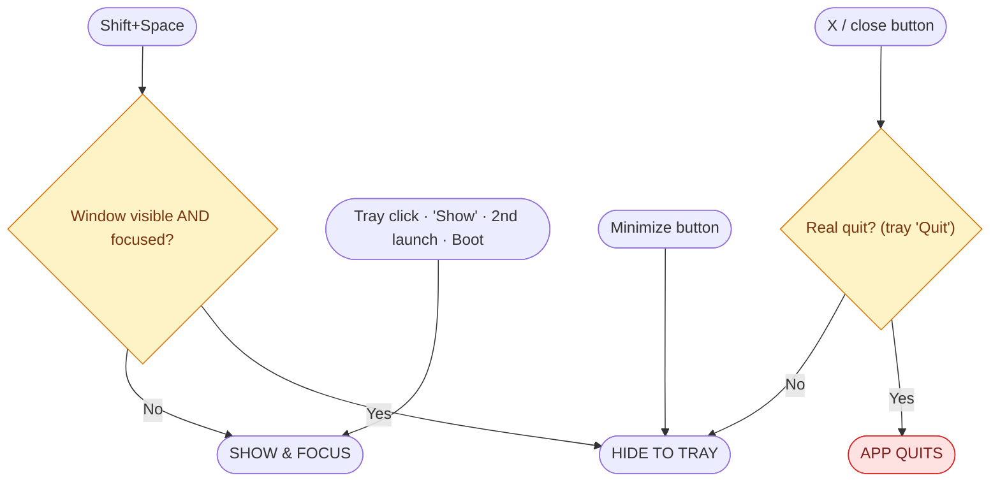
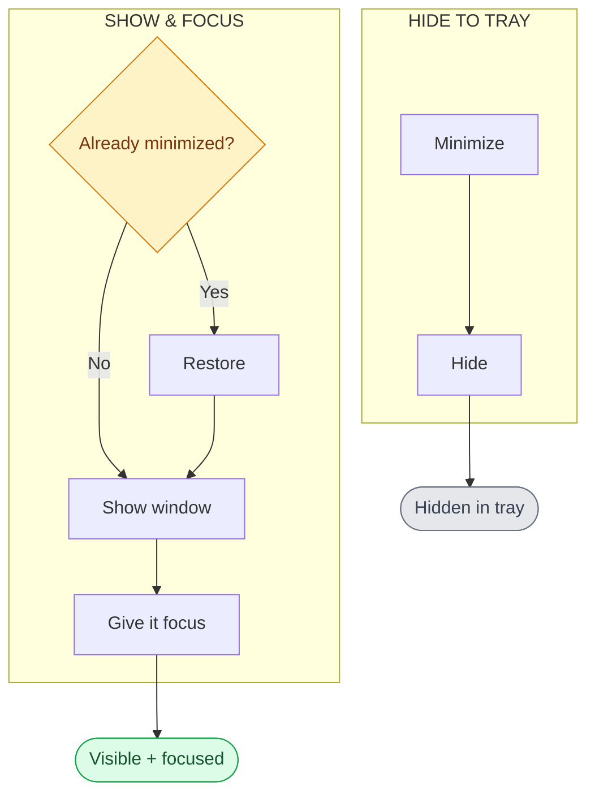

# Window state & transition reference

The single reference for how the app window shows, hides, focuses, and quits.
Everything here is drawn from `src/main/index.ts` — it describes what the code
is **intended** to do. Rows still marked _(unverified)_ have not been confirmed
against Electron docs or by repeat hands-on testing on Windows.

## States

| State | Meaning | On screen? | Has focus? |
| --- | --- | --- | --- |
| **Booting** | App starting, window not shown yet (`win` created with `show: false`). | no | no |
| **Visible + focused** | Window shown, in front, receiving input. | yes | yes |
| **Visible + unfocused** | Window shown, but another app has focus. | yes | no |
| **Hidden (tray)** | Minimized then hidden — only the tray icon remains. | no | no |
| **Quit** | `isQuitting` set, app shutting down. Terminal. | — | — |

> There is no stable "minimized but visible in the taskbar" state: the
> `minimize` event handler immediately calls `hide()`, so a native minimize
> lands the window in **Hidden (tray)**.

## Flowcharts

Two views. **Schematic 1** — which routine each trigger runs. **Schematic 2** —
what each routine (show / hide) actually does, step by step. Diamonds are yes/no
decisions.

## Transition table

| From | Input / event | Action in code | To |
| --- | --- | --- | --- |
| Booting | first boot, `ready-to-show` | `showAndFocusWindow()` | Visible + focused |
| Visible + focused | click another app | (OS-level, no handler) | Visible + unfocused |
| Visible + focused | `Shift+Space` | visible && focused → `hideToTray()` | Hidden (tray) |
| Visible + focused | X button | `preventDefault()` + `hideToTray()` | Hidden (tray) |
| Visible + focused | minimize button | `minimize` fires → `hide()` | Hidden (tray) |
| Visible + focused | tray Quit | `isQuitting = true`, `app.quit()` | Quit |
| Visible + unfocused | `Shift+Space` | not focused → `showAndFocusWindow()` | Visible + focused |
| Visible + unfocused | tray click / tray Show / second launch | `showAndFocusWindow()` | Visible + focused |
| Visible + unfocused | X button | `hideToTray()` | Hidden (tray) |
| Visible + unfocused | minimize button | `hide()` | Hidden (tray) |
| Visible + unfocused | tray Quit | `app.quit()` | Quit |
| Hidden (tray) | `Shift+Space` | not visible → `showAndFocusWindow()` | Visible + focused |
| Hidden (tray) | tray click / tray Show / second launch | `showAndFocusWindow()` | Visible + focused |
| Hidden (tray) | tray Quit | `app.quit()` | Quit |

## The two rules the code is built around

1. **Hiding is always minimize → hide** (`hideToTray()`). A bare `hide()` is
   never used from a stable state; minimize first hands focus back to the
   previously active app, then hide drops us to the tray.
2. **Showing is always followed by focus** (`showAndFocusWindow()`): restore if
   minimized, then `show()`, then `focus()` — `focus()` last so it isn't
   dropped.

## Not yet verified

These are assumptions baked into the code, not confirmed facts:

- That on Windows `show()` foregrounds the window, so `focus()` must come
  **after** `show()`/`restore()` or it gets dropped. _(unverified)_
- That a native `minimize` cannot be canceled (handler runs after the fact),
  which is why we route it to `hide()` rather than prevent it. _(unverified)_
- That `Shift+Space` reliably re-focuses on every show across many cycles —
  the toggle's "visible but unfocused → focus" path is the main risk area.
  _(unverified)_
